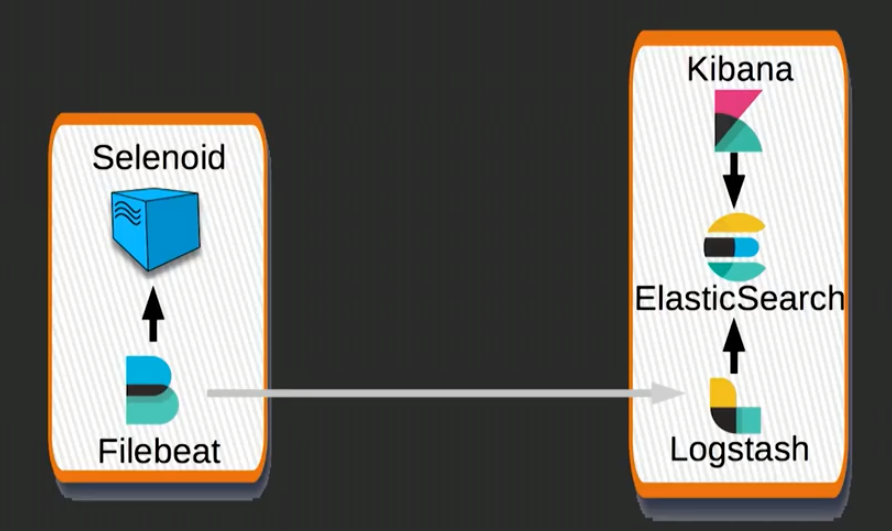

## Using ELK for Selenoid metrics
 * https://youtu.be/G-TrW9SZRNg?t=1089
 

 
* Send metrics from http://localhost:4444/status in JSON format by Filebeat to Logstash
* Metrics are sent by Filebeat and should be installed on the instance where Selenoid is.

### FileBeat

* we can configure Filebeat in `filebeat.yml` so that it would send Docker container logs to Logstash automatically. Als, we can
* Change URL (`output.logstash`) in `filebeat.yml` - on which instance of Logstash need to send data

### Logstash
* Logstash need `pipeline.yml` to list all the filebeats (data providers) listening on which port. 
* Filters - Also contains filters - what needs to be processed. 
* Output - sends data to elasticsearch 

### Kibana
* Need to setup index patterns - which collections we want how from Elasticsearch

## Resources:
* https://github.com/aerokube/elk-config
* https://medium.com/@aandryashin/selenium-clear-as-a-bell-64b672f42689


----
**From https://github.com/aerokube/elk-config**
# Aerokube ELK Stack Configs

This repository contains example configuration files used to send logs from Aerokube products to [Elastic](http://elastic.co/) stack. We are using:
* [Filebeat](https://www.elastic.co/products/beats/filebeat) to collect log files of running Aerokube tools containers.
* [Logstash](https://www.elastic.co/products/logstash) to preprocess log files.
* [ElasticSearch](https://www.elastic.co/products/elasticsearch) to store and index log data.
* [Kibana](https://www.elastic.co/products/kibana) as user interface.

## Quick Start Guide

1) We assume here that you have two **Linux** hosts: first with Selenoid or Ggr (application host) and second where logs will be stored (ELK host).

2) On application host go to `beats` directory and start Filebeat with Docker Compose:
```
$ cd beats
$ docker-compose up -d
```
3) On the ELK host go to `elk` directory and start ELK stack with Docker compose:
```
$ cd elk
$ docker-compose up -d
```
