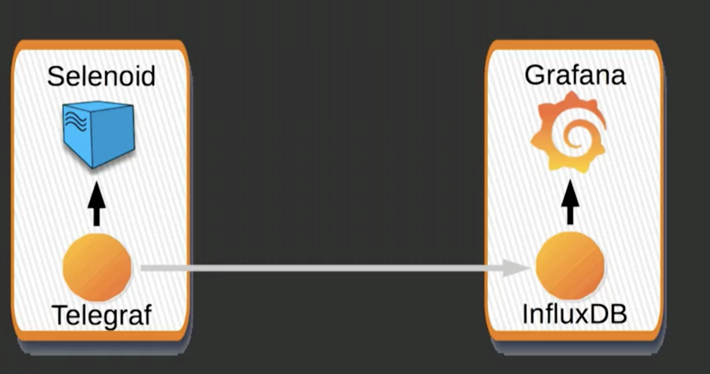

## Using InfluxDb + Grafana for Selenoid metrics
 * https://www.youtube.com/watch?v=G-TrW9SZRNg&t=670s
 

 
 
 
* Send metrics from http://localhost:4444/status by **Telegraf** in JSON format to **InfluxDB**
* Metrics are sent by Telegraf and should be installed on the instance where Selenoid is.

So if InfluxDb+Grafana is running on different machines, then
1. `docker-compose up` only **influxdb** and **grafana** instance (delete telegraf from docker-compose)
2. `docker-compose up` only telegraf on the instance where Selenoid is running 
3. change INFLUXDB_URI in docker-compose file to real ip address

## Use already prepared Dashboard by Aerokube 
1. Go to https://grafana.com/grafana/dashboards/3632 and copy Dashboard ID
2. Import Dashboard id after starting upo grafana locally

## Changing configuration for MAC
1. go to telegraf.conf and parametrzie `servers`, so that it will be set in docker-compose file
2. add to docker-compose file parameter - `SERVER: "http://docker.for.mac.host.internal:4444/status"`
3. `docker.for.mac.host.internal` can be parametrzied in .env file

## Resources:
* https://github.com/aerokube/selenoid-grafana-example
* https://www.youtube.com/watch?v=G-TrW9SZRNg&t=1418s
* https://medium.com/@aandryashin/selenium-clear-as-a-bell-64b672f42689
